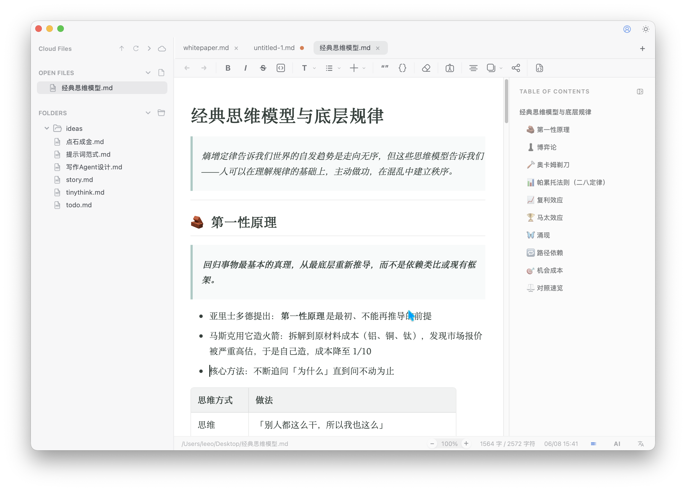
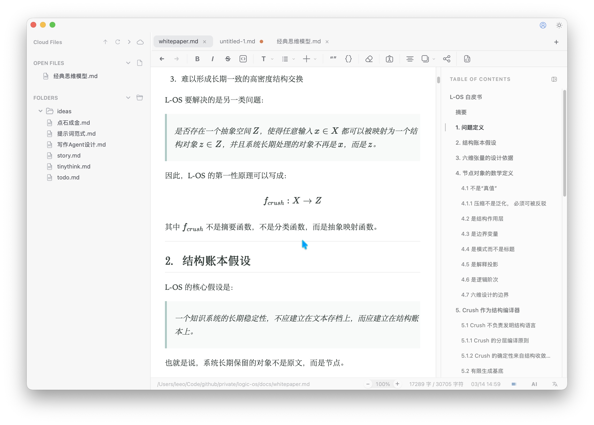
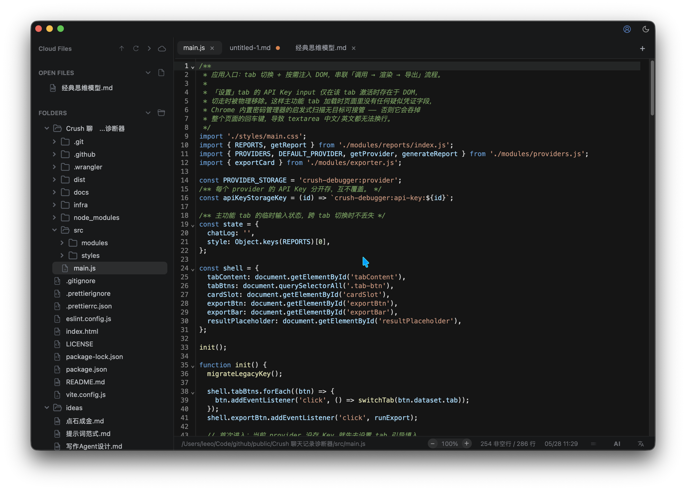

[简体中文](README.md) | [繁體中文](README.zh-TW.md) | **English**

# Mark2

Mark2 is a desktop Markdown app for focused writing and reading.

It brings local file management, Markdown editing, source mode, PDF reading, code viewing, math rendering, and card export into one workspace. AI is not a persistent sidebar that interrupts writing. It stays close to context: near the cursor, around selected text, or inside a lightweight current-document task dialog.



## Why Mark2

Mark2 is not trying to become a massive knowledge system. It is designed to be small, fast, simple, and genuinely useful for writing.

- **Small and fast**: Mark2 is built with Tauri, backed by Rust, and the app is under 30 MB. Startup and interaction are lightweight, so you do not need to open a heavy workspace just to write an article.
- **Simple to learn**: many Markdown tools are powerful but crowded, with complex plugin systems and high setup cost. Mark2 keeps the common writing tools ready out of the box, so you can open it and start writing.
- **AI inside the writing flow**: Mark2 does not treat AI as an agent that takes a prompt and outputs a full article in one shot. It works more like a writing partner: continuing at the cursor, suggesting ideas when you are stuck, polishing, expanding, shortening selected text, and summarizing or organizing the current document.
- **Complete document support**: beyond Markdown, Mark2 supports PDF, code, images, audio/video, spreadsheets, and Word import. It is not just an `.md` editor; it brings reading, writing, organizing, and exporting into one document-centered workflow.
- **Short path to output**: finished content can be exported directly as image cards, making it easy to share notes, arguments, excerpts, or article fragments.

Mark2 is for people whose main output is text: articles, tutorials, stories, research notes, PDF reading notes, code documentation, and content that eventually needs to be revised, published, or shared. It does much more than you would expect from an app under 30 MB, while still staying lightweight to use.

## How Mark2 Differs From Obsidian And Notion

Mark2 is not trying to replace every document tool. It focuses on the workflow writers repeat every day: read source material, write, revise with AI, and export.

- If you need backlinks, knowledge graphs, and a large plugin ecosystem, Obsidian is a better fit. Mark2 does not build its core experience around graphs and plugins; it focuses more on the quality of individual documents and the reading experience around them.
- If you need team collaboration, databases, project pages, and an online workspace, Notion is a better fit. Mark2 uses local files and Markdown, which works better for offline writing, long-term ownership, Git, and migration across tools.
- If you want a lightweight desktop app that brings Markdown writing, PDF/code reading, AI assistance, and card export together, Mark2 is the more direct choice.

## AI Writing

### Continue From The Cursor

A small AI entry appears around the current line. Ask AI to continue from the current document context; the result appears as ghost text first, then you decide whether to accept it.


### Get Writing Ideas

When you are stuck, AI can suggest what to write next. Ideas are not forced into the document; they are directions you can insert and expand.


### Process The Current Document

For tasks like “summarize this document”, “check structure issues”, or “generate an outline from the current draft”, open the AI document task dialog and type an instruction. Simple answers stay in the dialog; document-shaped results open as a temporary document.

## Markdown Writing And Reading

Mark2 supports both WYSIWYG editing and source mode. It works for drafts, notes, technical docs, and long-form writing. The editor can adapt page width automatically, and you can also adjust reading margins manually.

## Technical Content

### Math

Built-in KaTeX rendering works well for notes, tutorials, and research material with equations.



### Code

Code files can be opened and edited directly. Markdown code blocks are also styled for reading and quick copying.



### PDF

Read PDFs directly in Mark2 while writing Markdown notes in the same workspace.


## Card Export

Selected document content can be exported as image cards, suitable for sharing notes, excerpts, arguments, or article fragments.


## Supported Content Types

- Markdown
- Code files
- Images
- Audio / video
- PDF
- CSV / Excel spreadsheets
- Word document import

## Good For

- Writing articles, fiction, scripts, tutorials, and research notes
- Reading PDFs, code, and source material while organizing Markdown
- Using AI for continuation, ideas, polishing, expansion, shortening, and document summaries
- Exporting content as shareable cards

## Install

Download the latest release from [GitHub Releases](../../releases) and drop it into `Applications`.

## Languages

Mark2 supports Simplified Chinese, Traditional Chinese, and English. Switch under **Settings > General > Language**.

## Development

```bash
npm install
npm run tauri:dev
npm run tauri:build
```

## Tech Stack

- [Tauri](https://tauri.app/)
- [Vite](https://vitejs.dev/)
- Vanilla JavaScript
- [TipTap](https://tiptap.dev/)
- [CodeMirror](https://codemirror.net/)
- [KaTeX](https://katex.org/)
- [PDF.js](https://mozilla.github.io/pdf.js/)
- [Mermaid](https://mermaid.js.org/)
- [modern-screenshot](https://github.com/qq15725/modern-screenshot)

## Project Docs

- Architecture: [docs/ARCHITECTURE.md](docs/ARCHITECTURE.md)
- Development guide: [docs/DEVELOPMENT.md](docs/DEVELOPMENT.md)
- Debug conventions: [docs/DEBUG_CONVENTIONS.md](docs/DEBUG_CONVENTIONS.md)

## License

MIT
