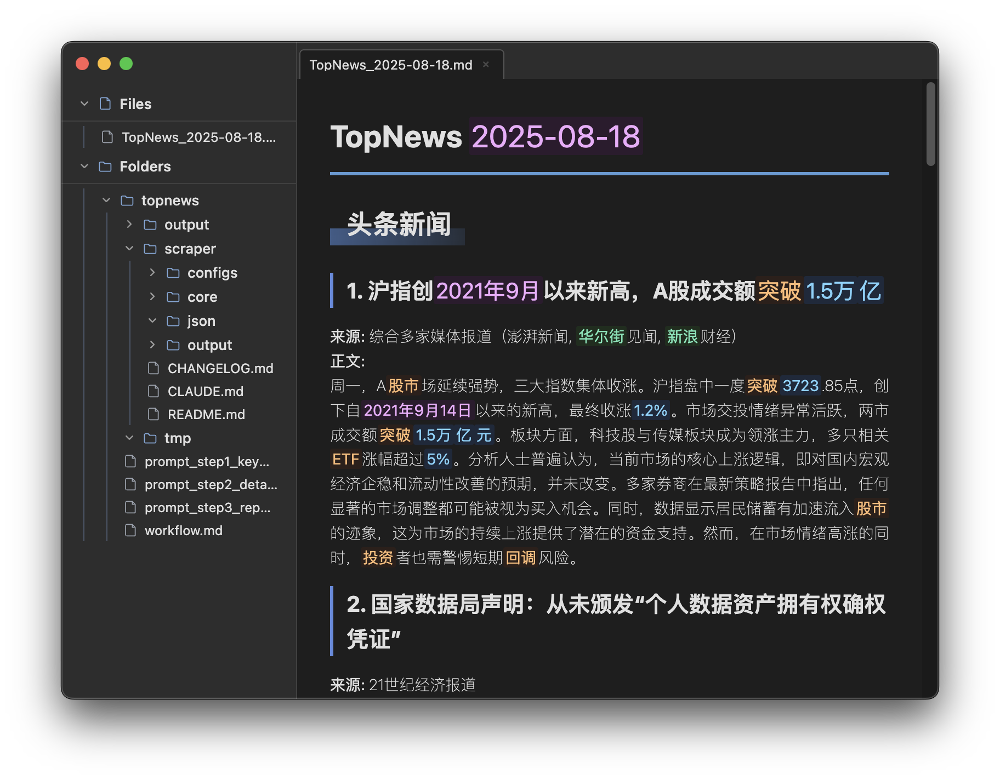

# MARK2

一个基于 Electron 的现代化 Markdown 阅读器和编辑器，提供双栏界面、实时预览和强大的插件系统。




## ✨ 特性

### 核心功能
- 📝 **双模式编辑器**: 支持预览和编辑模式实时切换
- 🗂️ **智能文件树**: 左侧栏文件浏览器，支持文件夹展开/折叠
- 🎨 **主题系统**: 内置浅色和深色主题，自动适配系统设置
- 📱 **多标签页**: 智能标签页管理，支持文件和文件夹归属
- 🔍 **全文搜索**: 快速搜索文件内容
- 💾 **自动保存**: 实时文件监听，自动同步外部修改

### 高级功能
- 📸 **智能截图**: 基于 html-to-image 的全页截图，**双重保存机制**支持文件夹粘贴
- 🔌 **插件系统**: 可扩展的插件架构，支持自定义功能
- ⚡ **性能优化**: 基于 CodeMirror 6 的高性能编辑器
- 🖱️ **原生体验**: 支持文件拖拽、系统集成和键盘快捷键
- 🔄 **状态恢复**: 自动保存工作状态，支持系统休眠恢复

## 🚀 快速开始

### 系统要求
- **macOS**: 10.13+ (支持 Intel 和 Apple Silicon)
- **Windows**: Windows 10+
- **Linux**: Ubuntu 18.04+

### 安装方式

#### 1. 下载预构建版本
从 [Releases](../../releases) 页面下载对应平台的安装包：
- macOS: `MARK2-1.1.9-arm64.dmg` (Apple Silicon) 或 `MARK2-1.1.9.dmg` (Intel)
- Windows: `MARK2-1.1.9.exe`
- Linux: `MARK2-1.1.9.AppImage`

#### 2. 从源码构建
```bash
# 克隆仓库
git clone <repository-url>
cd mark2

# 安装依赖
npm install

# 开发模式运行
npm run dev

# 构建应用
npm run build
```

## 🎯 使用方法

### 基本操作
```bash
# 启动应用
npm start

# 开发模式（包含开发者工具）
npm run dev

# 直接打开文件
npm start README.md
npm start /path/to/file.md
```

### 键盘快捷键
| 快捷键 | 功能 |
|--------|------|
| `Ctrl/Cmd + O` | 打开文件 |
| `Ctrl/Cmd + Shift + O` | 打开文件夹 |
| `Ctrl/Cmd + S` | 保存文件 |
| `Ctrl/Cmd + E` | 切换编辑/预览模式 |
| `Ctrl/Cmd + B` | 切换侧边栏 |
| `Ctrl/Cmd + Shift + C` | 截图功能 |
| `Ctrl/Cmd + ,` | 打开设置 |
| `F12` | 开发者工具 |

## 🔌 插件系统

MARK2 支持强大的插件生态系统：

### 内置插件
- **关键词高亮**: 智能识别数字、日期、实体和热词
- **Todo 列表**: 美化的任务列表渲染
- **截图工具**: 基于 html-to-image 的全页截图，支持双重保存机制

### 插件开发
```javascript
// plugins/my-plugin/index.js
class MyPlugin extends BasePlugin {
  constructor() {
    super('my-plugin', '我的插件', '1.0.0');
    this.patterns = [
      { regex: /特定模式/g, className: 'my-highlight' }
    ];
    this.styleConfig = {
      'my-highlight': { backgroundColor: '#yellow' }
    };
  }

  processMarkdown(html) {
    return this.applyPatterns(html);
  }
}
```

### 插件安装
1. 下载插件 `.zip` 文件
2. 通过菜单 "工具 → 插件目录" 打开插件目录
3. 解压插件到目录中
4. 重启应用或刷新插件列表

## 🛠️ 开发

### 技术栈
- **前端**: Electron, CodeMirror 6, HTML/CSS/JavaScript
- **构建**: electron-builder, @electron/rebuild
- **图像处理**: html-to-image (前端截图库)
- **Markdown**: marked.js, highlight.js

### 项目结构
```
mark2/
├── main.js                 # Electron 主进程入口
├── renderer.js             # 渲染进程脚本
├── src/
│   ├── main/               # 主进程模块
│   │   ├── WindowManager.js
│   │   ├── FileManager.js
│   │   └── IPCHandler.js
│   └── renderer/           # 渲染进程模块
│       ├── AppManager.js
│       ├── EditorManager.js
│       └── UIManager.js
├── plugins/                # 插件系统
├── styles/                 # 样式文件
└── test/                   # 测试文件
```

### 开发命令
```bash
# 安装依赖
npm install

# 开发模式
npm run dev

# 重建原生模块
npm run rebuild

# 构建应用
npm run build

# 测试特定功能
npm start test/example.md
```

### 调试
- 所有日志自动保存到 `debug.log` 文件
- 使用 `F12` 打开开发者工具
- 主进程日志显示在终端

## 📦 构建和发布

### 构建配置
项目支持多平台和多架构构建：

```bash
# 构建所有平台
npm run build

# 仅构建当前平台
npx electron-builder --publish=never
```

### 构建优化
项目构建时会：
1. 优化资源打包和压缩
2. 确保跨平台兼容性
3. 自动处理依赖关系

## 🐛 问题排查

### 常见问题

#### 1. 依赖模块错误
```bash
# 清理并重新安装依赖
rm -rf node_modules package-lock.json
npm install

# 检查依赖版本
npm list
```

#### 2. 构建失败
```bash
# 检查 Electron 版本兼容性
npm list electron

# 更新构建工具
npm update electron-builder @electron/rebuild
```

#### 3. 系统休眠后功能异常
应用内置了系统休眠恢复机制，会自动重建 IPC 连接。如果问题持续，请重启应用。

#### 4. 截图无法粘贴为文件
应用使用双重保存机制：
- **剪切板模式**: 图像数据，支持应用内粘贴
- **文件模式**: 临时文件，支持文件管理器粘贴
- **双重模式**: 两种方式同时保存（默认）

如果无法在文件夹中粘贴，请检查：
- macOS: 确保在 Finder 中使用 `Cmd+V` 粘贴
- 临时文件位置: 系统临时目录（24小时自动清理）
- 权限问题: 确保应用有文件写入权限

### 获取帮助
- 查看 `debug.log` 文件获取详细错误信息
- 查看 `MISTAKES.md` 了解常见开发陷阱
- 提交 Issue 时请附带系统信息和错误日志

## 📄 许可证

本项目基于 MIT 许可证开源 - 查看 [LICENSE](LICENSE) 文件了解详情。

## 🤝 贡献

欢迎贡献代码！请先阅读 [CLAUDE.md](CLAUDE.md) 了解项目架构和开发规范。

### 贡献步骤
1. Fork 本仓库
2. 创建功能分支 (`git checkout -b feature/amazing-feature`)
3. 提交更改 (`git commit -m 'Add amazing feature'`)
4. 推送到分支 (`git push origin feature/amazing-feature`)
5. 创建 Pull Request

---

<div align="center">
  <p>用 ❤️ 和 ☕ 制作</p>
  <p>专为 Markdown 爱好者打造的现代化编辑器</p>
</div>