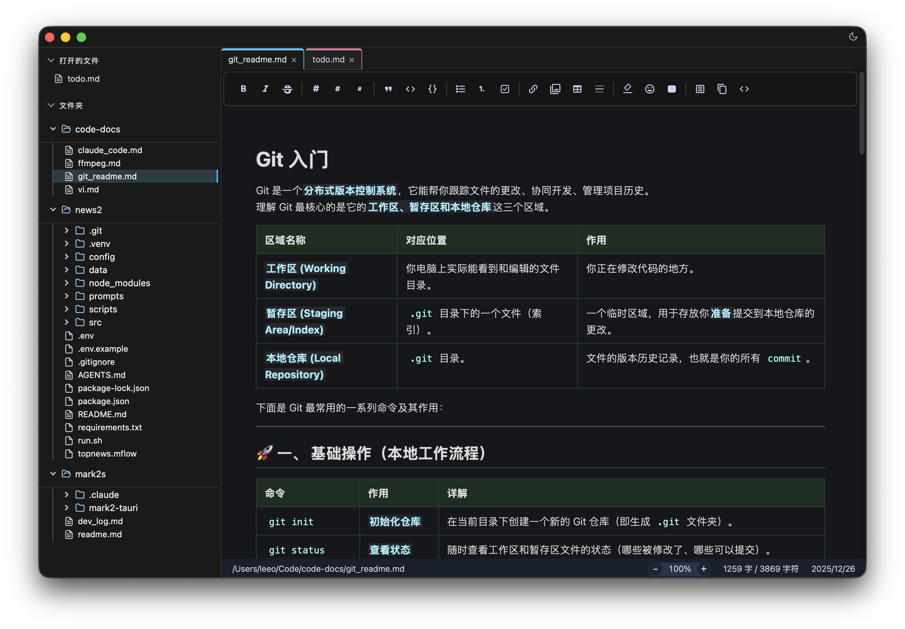

# Mark2

一个轻量、快速、功能丰富的 Markdown 编辑器。



## 为什么选择 Mark2？

**不只是 Markdown 编辑器**——Mark2 是一个完整的知识工作站。

| 特性 | 说明 |
| --- | --- |
| **极致轻量** | 基于 Tauri + 原生 JS，无框架负担，启动快如闪电 |
| **全格式支持** | Markdown、代码、图片、音视频、PDF、Excel，一个应用搞定 |
| **AI 深度集成** | 内置 AI 助手，写作、润色、翻译一键完成 |
| **Workflow** | AI 驱动的卡片式工作流，让复杂创作变得简单 |
| **卡片导出** | 一键生成精美图片/PDF，分享到社交媒体 |

## 核心功能

### 📝 Markdown 编辑

- 所见即所得 + 源码模式自由切换
- 实时预览，语法高亮
- 支持 GFM、表格、任务列表、数学公式
- 50+ 编程语言代码高亮

### 🤖 AI 助手

- 侧边栏 AI 对话，随时调用
- 智能续写、润色、翻译
- 上下文感知，理解你正在编辑的内容

### 🎯 Workflow（AI 工作流）

与传统 AI 对话不同，Workflow 通过**分步引导、逐层确认**的方式，让你参与整个思考过程：

```
任务目标 → 信息收集 → 分析整理 → 创意生成 → 最终产出
```

- 每一步都可以修改、确认后再继续
- 修改任意步骤，后续自动重新生成
- 工作流可保存为 `.mflow` 文件，随时继续

### 🎨 卡片导出

把你的内容变成精美的分享图片：

- 多种主题风格
- 自定义样式
- 一键导出 PNG/PDF

### 📂 文件管理

- 文件树侧边栏
- 多标签页
- 最近文件快速访问

## 快速开始

### 方式一：从 Mac App Store 安装

搜索 "Mark2" 并安装。

> 注：App Store 版本因沙盒限制，Workflow 和脚本执行功能不可用。

### 方式二：下载 DMG（完整功能）

从 [GitHub Releases](../../releases) 下载最新 DMG，拖入 Applications 即可。

## 开发

```bash
# 安装依赖
npm install

# 启动开发模式
npm run tauri:dev

# 构建应用
npm run tauri:build
```

## 技术栈

- **框架**: [Tauri](https://tauri.app/) (Rust + WebView)
- **前端**: 原生 JavaScript（无 React/Vue）
- **编辑器**: [TipTap](https://tiptap.dev/) + [Monaco Editor](https://microsoft.github.io/monaco-editor/)
- **PDF**: [PDF.js](https://mozilla.github.io/pdf.js/)
- **图表**: [Mermaid](https://mermaid.js.org/)

## 项目结构

```
src/
├── components/          # UI 组件（编辑器、查看器）
├── modules/             # 功能模块（AI 助手、卡片导出）
├── state/               # 状态管理
├── core/                # 基础设施（EventBus、IO）
└── utils/               # 工具函数

src-tauri/               # Rust 后端
styles/                  # 样式文件
docs/                    # 开发文档
```

详细架构见 [docs/ARCHITECTURE.md](docs/ARCHITECTURE.md)。

## 许可证

MIT

