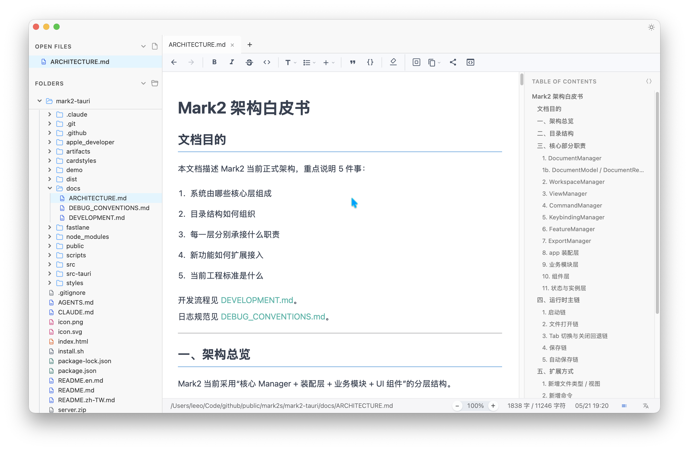
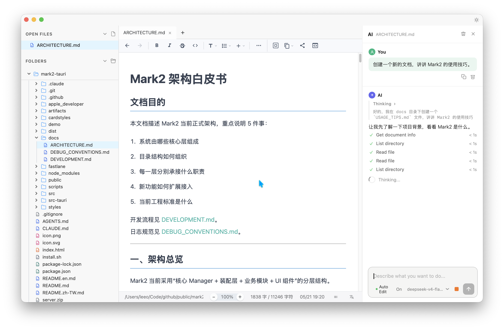
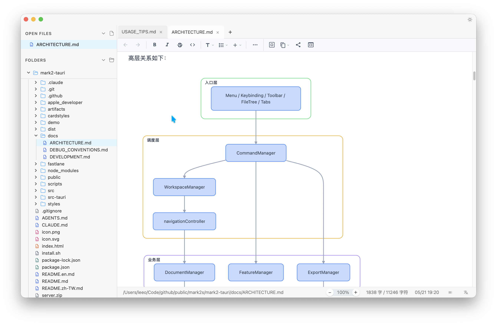
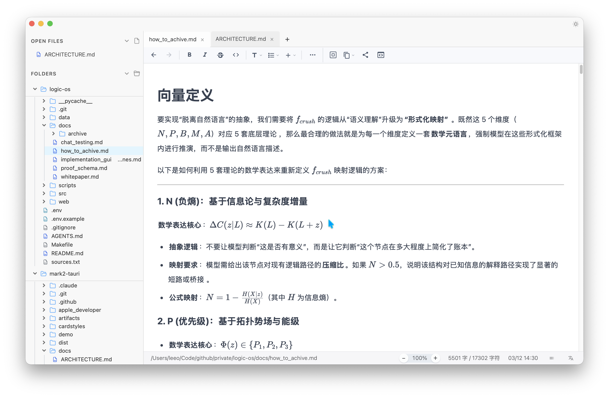
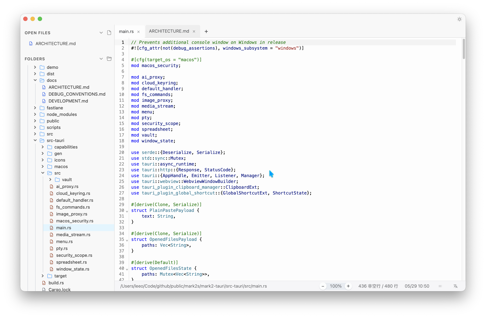
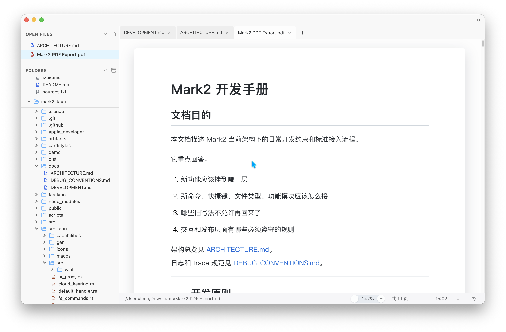
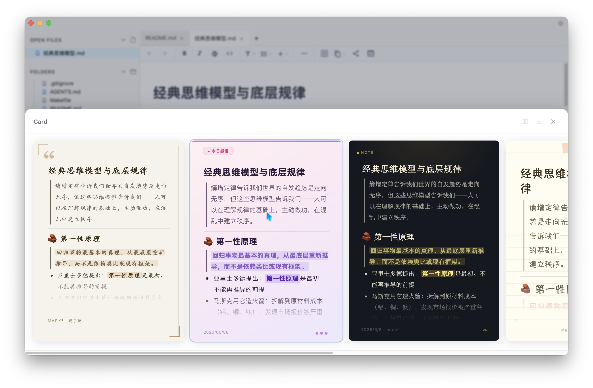
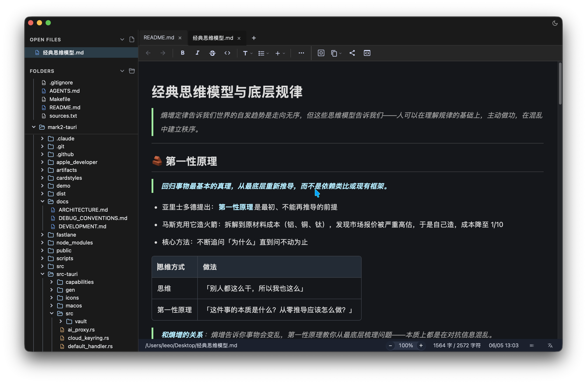
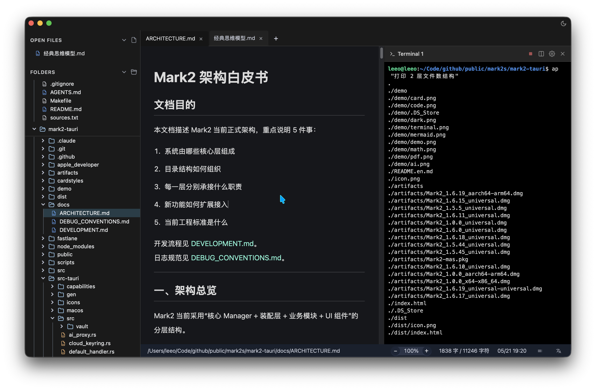

# Mark2

Mark2 是一个面向重度写作、资料处理和内容输出的桌面工作台。
它把 Markdown 编辑、代码阅读、文档导入、AI 辅助、卡片导出和本地文件管理放进了同一个应用里。



## 为什么是 Mark2

- 快。基于 Tauri 和原生 JavaScript，启动轻，交互直接。
- 全。Markdown、代码、图片、音视频、PDF、表格、Word 都能在同一个工作区处理。
- 深。AI 直接理解当前文档和上下文，不是游离在编辑器外面的聊天框。
- 美。内置卡片导出和主题化展示，内容从写作到分享可以一条链完成。

## 核心体验

### AI 助手

AI 助手和当前文档深度绑定，可以读取文档、改写内容、生成段落、辅助润色和整理材料。



### Markdown 写作

Mark2 的核心工作区围绕 Markdown 展开，支持所见即所得编辑、源码模式、任务列表、表格、数学公式、Mermaid 等常用能力。



### 数学公式

Mark2 内置数学公式渲染能力，适合写技术文档、学习笔记、研究记录和带公式的讲解内容。



### 代码与技术内容

除了 Markdown，Mark2 也适合处理代码和技术文档。代码文件可以直接查看和编辑，适合写说明、看脚本、改配置。



### PDF 与资料阅读

PDF、图片、媒体和多种附件格式都可以直接在工作区内查看，适合一边读资料一边整理输出。



### 卡片导出

文档内容可以快速整理成适合分享的卡片图。Mark2 内置卡片样式和导出能力，适合做社交媒体内容、摘要图和视觉化摘录。



### 深色界面

在长时间写作和阅读场景下，深色主题更适合夜间和沉浸式工作流。



### 内置终端

Mark2 提供内置终端面板，方便在同一工作区内执行脚本、查看输出和处理本地开发任务。



## 支持的内容类型

- Markdown
- 代码文件
- 图片
- 音视频
- PDF
- CSV / Excel 表格
- Word 文档导入

## 适合什么场景

- 写文章、做选题、整理材料
- 阅读 PDF、文档、代码并输出笔记
- 用 AI 对当前稿件做润色、改写和补写
- 把内容导出成分享卡片
- 在同一工作区里完成“阅读 -> 写作 -> 导出”

## 安装

从 [GitHub Releases](../../releases) 下载最新版本，拖入 `Applications` 即可。

## 开发

```bash
npm install
npm run tauri:dev
npm run tauri:build
```

## 技术栈

- [Tauri](https://tauri.app/)
- [Vite](https://vitejs.dev/)
- 原生 JavaScript
- [TipTap](https://tiptap.dev/)
- [CodeMirror](https://codemirror.net/)
- [KaTeX](https://katex.org/)
- [PDF.js](https://mozilla.github.io/pdf.js/)
- [Mermaid](https://mermaid.js.org/)
- [xterm.js](https://xtermjs.org/)
- [Paged.js](https://pagedjs.org/)
- [modern-screenshot](https://github.com/qq15725/modern-screenshot)

## 项目文档

- 架构白皮书：[docs/ARCHITECTURE.md](docs/ARCHITECTURE.md)
- 开发手册：[docs/DEVELOPMENT.md](docs/DEVELOPMENT.md)
- 调试规范：[docs/DEBUG_CONVENTIONS.md](docs/DEBUG_CONVENTIONS.md)

## 许可证

MIT

