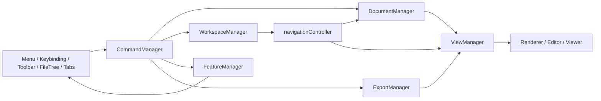

# Mark2 架构白皮书

## 文档目的

本文档是 Mark2 当前正式架构的白皮书版本。

它回答 4 个问题：

1. 当前系统的核心真源是什么
2. 核心链路由哪些 Manager 承接
3. 新功能应该挂到哪一层
4. 什么写法符合当前架构，什么写法会重新把系统带回旧胶水模式

这份文档描述的是**重构完成后的现状**，不是重构计划，也不是探索性草案。

---

## 一、设计原则

### 1. 单一真源

同一个事实只允许有一个正式写入口。

当前系统已经把几个最容易漂移的事实收敛到以下真源：

- 当前文档身份：`DocumentManager`
- 当前工作区快照：`WorkspaceManager`
- 当前命令入口：`CommandManager`
- 当前视图激活协议：`ViewManager`
- 当前功能模块挂载：`FeatureManager`
- 当前导出能力：`ExportManager`

`AppState` 仍然存在，但它现在更偏向 UI 共享状态与兼容镜像层，而不是所有业务事实的最终来源。

### 2. 事务先于 UI

业务切换必须先做状态决策，再让 UI 反映结果。

例如 tab 切换和关闭回退，当前已经按这个原则收口：

- 先决定下一个激活 tab
- 再统一提交 tab 激活、file tree 选中、文档加载
- UI 不再反向驱动业务链路

### 3. 命令统一入口

菜单、快捷键、context menu、toolbar 触发的系统动作，必须先进入命令层。

禁止新增“某个按钮直接调某个业务函数”的新胶水。

### 4. 协议优于散传函数

新架构尽量避免把 `activateMarkdownView / activateCodeView / ...` 这种细粒度函数到处散传。

更推荐传稳定协议对象，例如：

- `view.activate(mode, options)`
- `featureManager.getFeatureApi(id)`
- `commandManager.executeCommand(id, payload, context)`

### 5. 可观测性内建

关键链路必须可日志化、可回放、可定位。

当前正式日志域见 [DEBUG_CONVENTIONS.md](/Users/leeo/Code/github/public/mark2s/mark2-tauri/docs/DEBUG_CONVENTIONS.md)。

---

## 二、系统总览

### 1. 核心 Manager

当前系统的核心内核由 6 个 Manager 组成：

| Manager | 职责 |
|---|---|
| `DocumentManager` | 文档身份、激活态、rename、dirty、save 目标路径 |
| `WorkspaceManager` | open files、shared tab、sidebar、workspace snapshot 持久化 |
| `ViewManager` | 视图模式解析、渲染器分发、视图激活协议 |
| `CommandManager` | 统一命令注册与执行 |
| `KeybindingManager` | 快捷键到命令的绑定 |
| `FeatureManager` | AI / Terminal / Card Export / Scratchpad 等功能模块挂载 |

另外还有一个跨域能力 Manager：

| Manager | 职责 |
|---|---|
| `ExportManager` | 导出图片/PDF 等导出能力 |

### 2. 高层关系



---

## 三、核心状态模型

### 1. DocumentManager

`DocumentManager` 是文档生命周期的正式真源。

它负责：

- 当前激活文档 path
- 文档 tabId/path/viewMode/sessionId 的对应关系
- `open / activate / rename / close`
- `dirty` 状态
- 保存链路读取的 active path

任何“当前文档是谁”的判断，应该优先从 `DocumentManager` 得出，而不是依赖某个 editor 内部缓存路径。

典型链路：

```text
handleFileSelect
  -> DocumentManager.openDocument / syncActiveDocument
  -> loadFile
  -> saveCurrentFile 读取 active path
```

### 2. WorkspaceManager

`WorkspaceManager` 负责工作区级快照，而不是文档级业务。

它维护：

- `openFiles`
- `sharedTabPath`
- `currentFile`
- sidebar 状态
- workspace restore / persist

它的角色是“工作区真源”，不是“文档内容真源”。

### 3. ViewManager

`ViewManager` 负责“当前文档如何展示”，不负责“当前文档是谁”。

它维护的正式协议包括：

- `resolveViewMode(filePath)`
- `resolveRenderer(filePath, targetViewMode)`
- `activateView(viewMode, viewOptions)`
- `createViewProtocol()`

`createViewProtocol()` 是当前视图层最重要的稳定接口。

现在以下调用方都已经统一依赖它：

- `fileOperations`
- renderer handlers
- markdown/code/svg/csv mode toggle
- `windowLifecycle`
- `fileMenuActions`

### 4. CommandManager 与 KeybindingManager

`CommandManager` 定义系统“能做什么”，`KeybindingManager` 定义“按什么触发”。

新增系统动作时，标准路径是：

1. 注册 command id
2. 在 `commandSetup` 注册 handler
3. 如有需要，在 `KeybindingManager` 注册默认快捷键
4. UI 入口统一执行 command

### 5. FeatureManager

`FeatureManager` 统一挂载业务功能模块。

当前已经纳入：

- `ai-sidebar`
- `terminal`
- `scratchpad`
- `card-export`

功能模块通过 `mount / unmount / getApi` 参与应用，而不是直接在 `main.js` 里手工拼装。

### 6. ExportManager

`ExportManager` 统一管理导出能力。

当前导出链路是：

```text
menu
  -> command
  -> ExportManager
  -> exporter
```

这避免了导出逻辑继续散落在菜单层和视图层之间。

---

## 四、运行时主链

### 1. 启动链

高层启动顺序如下：

1. `main.js` 初始化基础设施与状态容器
2. 创建核心 Manager
3. 创建 controller 与 setup 层
4. 通过 `appBootstrap` 注册命令、功能、导出能力
5. 恢复 workspace
6. 恢复或打开当前文档

### 2. 文件打开链

当前文件打开链已经收敛为：

```text
fileTree / recent / open dialog
  -> handleFileSelect
  -> fileOperations.loadFile
  -> ViewManager.resolveViewMode
  -> ViewManager.resolveRenderer
  -> renderer.load(...)
  -> DocumentManager / WorkspaceManager 同步
```

导入型文件也走这条主链，但在 renderer 内转换为 untitled 文档：

- `docx`
- `pptx`
- `spreadsheet` 导入型场景

### 3. Tab 切换与关闭回退链

这是本轮重构前最脆弱的一段，现在已经改成事务模型。

正式链路：

```text
tab intent
  -> activateTabTransition
  -> resolve fallback / commit active tab
  -> silent sync fileTree
  -> handleFileSelect
  -> loadFile
```

以下场景都已经迁到这条事务链：

- 普通 tab 点击切换
- 关闭 file tab 后回退
- 关闭 untitled/import tab 后回退
- 关闭 shared tab 后回退
- 删除当前文件后的 fallback 激活

### 4. 保存链

正式保存链以 `DocumentManager` 的 active path 为准，不再允许 editor 内部缓存路径单独决定写盘目标。

```text
document.save
  -> saveCurrentFile
  -> DocumentManager active path
  -> markdown/code writer
  -> dirty=false
```

### 5. 自动保存链

自动保存现在由导航切换链统一协调：

```text
handleFileSelect
  -> autoSaveActiveFileIfNeeded
  -> saveCurrentFile 或 skip
  -> load next file
```

同路径 no-op 切换已经短路，不再无意义重复 reload。

---

## 五、目录职责

### 1. `src/core/`

这里放内核级能力，不放具体业务功能。

当前核心目录含义：

- `core/documents/`：文档真源
- `core/workspace/`：工作区真源
- `core/views/`：视图协议与渲染器调度
- `core/commands/`：命令与快捷键
- `core/features/`：功能挂载
- `core/export/`：导出能力
- `core/diagnostics/`：日志和 trace

### 2. `src/app/`

放装配层和 setup/controller 层。

它们负责：

- 组装核心对象
- 连接 UI 与 Manager
- 保持初始化顺序清晰

它们不应该重新发明真源。

### 3. `src/modules/`

放业务模块和跨组件控制器。

例如：

- `navigationController`
- `fileOperations`
- `fileMenuActions`
- `recentFilesActions`
- `ai-assistant`
- `card-export`

模块可以有业务逻辑，但不应该绕开核心 Manager 自建第二套生命周期。

### 4. `src/components/`

放 UI 组件与编辑器/查看器实现。

组件层原则：

- 负责展示和交互
- 不持有跨模块的最终真源
- 尽量通过协议或 manager API 与外部协作

---

## 六、扩展模型

### 1. 新增文件类型/视图

新增文件类型时，标准路径是：

1. 在 `fileTypeUtils` 定义扩展名与默认视图模式
2. 在 `fileRenderers` 增加 renderer handler
3. 通过 `RendererRegistry` 注册
4. 如需要新增 pane/viewer，再接入 `viewController`
5. `ViewManager` 自动负责解析和分发

不要再在多个业务模块里各自写一段 `if (ext === ...)`。

### 2. 新增命令

标准路径：

1. 在 `commandIds.js` 新增命令 ID
2. 在 `commandSetup.js` 注册 handler
3. 如需要快捷键，在 `registerDefaultKeybindings` 注册
4. UI 调用 `executeCommand`

### 3. 新增功能模块

标准路径：

1. 在 `featureSetup.js` 注册 feature
2. 暴露 `mount / unmount / getApi`
3. 通过 `FeatureManager` 挂载

不要再直接在 `appBootstrap` 或 `main.js` 里散落 feature 实例变量。

### 4. 新增导出能力

标准路径：

1. 在 `exportSetup.js` 注册 exporter
2. 给它一个稳定 export id
3. 菜单或命令层通过 `ExportManager` 执行

---

## 七、正式约束

### 1. 允许的写法

- 用 `CommandManager` 承接系统动作
- 用 `DocumentManager` 判断当前文档
- 用 `WorkspaceManager` 持久化工作区
- 用 `ViewManager` 激活视图和解析 renderer
- 用 `FeatureManager` 管功能挂载
- 用结构化日志验证关键链路

### 2. 禁止回退的写法

- 在多个模块里各自维护一份 `currentFile`
- UI 组件直接决定文档最终状态
- 新增按钮直接调业务函数，不走 command
- 新增视图切换时继续散传 `activateXxxView`
- 为了修 bug 再加新的全局状态副本

---

## 八、调试与验收

当前架构默认支持结构化日志验收。

关键日志域：

- `documents`
- `workspace`
- `views`
- `commands`
- `features`
- `io`

详细规范见 [DEBUG_CONVENTIONS.md](/Users/leeo/Code/github/public/mark2s/mark2-tauri/docs/DEBUG_CONVENTIONS.md)。

重构验收记录保留在 [REFACTOR_CHECKLIST.md](/Users/leeo/Code/github/public/mark2s/mark2-tauri/docs/REFACTOR_CHECKLIST.md)。

---

## 九、当前文档集合

当前 `docs/` 建议保留为以下分工：

- `ARCHITECTURE.md`
  当前正式架构白皮书
- `DEVELOPMENT.md`
  开发规范、交互约束、发布流程
- `DEBUG_CONVENTIONS.md`
  日志与 trace 约定
- `REFACTOR_CHECKLIST.md`
  本轮架构重构与回归验收记录

历史性的蓝图、风险草案、已删除功能设计稿，不再作为正式文档保留。
