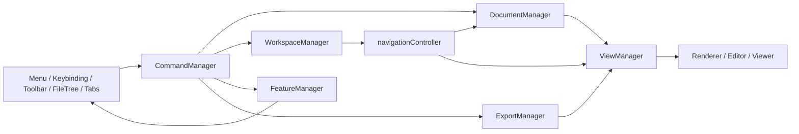

# Mark2 架构白皮书

## 文档目的

本文档描述 Mark2 当前正式架构，重点说明 5 件事：

1. 系统由哪些核心层组成
2. 目录结构如何组织
3. 每一层分别承接什么职责
4. 新功能如何扩展接入
5. 当前工程标准是什么

开发流程见 [DEVELOPMENT.md](/Users/leeo/Code/github/public/mark2s/mark2-tauri/docs/DEVELOPMENT.md)。
日志规范见 [DEBUG_CONVENTIONS.md](/Users/leeo/Code/github/public/mark2s/mark2-tauri/docs/DEBUG_CONVENTIONS.md)。

---

## 一、架构总览

Mark2 当前采用“核心 Manager + 装配层 + 业务模块 + UI 组件”的分层结构。

核心业务由以下 7 个 Manager 承接：

| Manager | 职责 |
| --- | --- |
| `DocumentManager` | 文档身份、激活态、rename、dirty、保存目标路径 |
| `WorkspaceManager` | open files、shared tab、sidebar 状态、workspace snapshot 持久化 |
| `ViewManager` | 视图模式解析、renderer 分发、视图激活协议 |
| `CommandManager` | 系统命令注册与执行 |
| `KeybindingManager` | 快捷键与命令绑定 |
| `FeatureManager` | AI、Terminal、Scratchpad、Card Export 等功能模块挂载 |
| `ExportManager` | 图片、PDF 等导出能力 |

`AppState` 负责共享 UI 状态与兼容镜像状态。
`navigationController`、`fileOperations`、`fileMenuActions` 等模块负责运行时事务协调。
`components/` 下的编辑器、查看器、面板组件负责展示与交互。

高层关系如下：



---

## 二、目录结构

当前核心目录结构如下：

```text
src/
  app/                  应用装配、setup、controller
  components/           UI 组件、编辑器、查看器、面板
  core/
    commands/           CommandManager、KeybindingManager
    diagnostics/        Logger、TraceRecorder、文件日志
    documents/          DocumentManager
    export/             ExportManager
    features/           FeatureManager
    views/              ViewManager
    workspace/          WorkspaceManager
  fileRenderers/        文件类型 renderer 与 handler
  modules/              业务模块与运行时控制器
  services/             基础服务与适配层
  state/                AppState、EditorRegistry 等共享状态
  utils/                工具函数与导出辅助

src-tauri/
  src/                  Rust 命令与桌面端能力
  icons/                应用图标资源
  gen/                  生成文件与 schema
```

目录分工如下：

| 目录 | 说明 |
| --- | --- |
| `src/core/` | 内核层，承接系统正式协议与真源 |
| `src/app/` | 装配层，负责初始化顺序与模块连接 |
| `src/modules/` | 业务模块与事务协调层 |
| `src/components/` | 展示层与交互层 |
| `src/fileRenderers/` | 文件类型渲染扩展层 |
| `src/state/` | 共享状态与实例注册 |
| `src/services/` | 文件、权限、AI 等服务封装 |
| `src/utils/` | 可复用工具与导出辅助逻辑 |
| `src-tauri/` | Tauri/Rust 桌面能力层 |

---

## 三、核心部分职责

### 1. DocumentManager

`DocumentManager` 承接文档生命周期真源。

它维护：

- 当前激活文档路径
- tabId、path、viewMode、sessionId 的关联关系
- `open / activate / rename / close`
- `dirty` 状态
- 保存链路使用的 active path

典型主链：

```text
handleFileSelect
  -> DocumentManager.openDocument / syncActiveDocument
  -> fileOperations.loadFile
  -> saveCurrentFile 读取 active path
```

### 2. WorkspaceManager

`WorkspaceManager` 承接工作区级快照。

它维护：

- `openFiles`
- `sharedTabPath`
- `currentFile`
- sidebar 状态
- workspace restore / persist

它支撑应用恢复、tab 集合恢复、shared tab 恢复和 sidebar 状态恢复。

### 3. ViewManager

`ViewManager` 承接视图模式和渲染协议。

它提供：

- `resolveViewMode(filePath)`
- `resolveRenderer(filePath, targetViewMode)`
- `activateView(viewMode, options)`
- `createViewProtocol()`

当前以下能力都通过 `ViewManager` 协议协作：

- `fileOperations`
- renderer handlers
- markdown/code/svg/csv mode toggle
- `windowLifecycle`
- `fileMenuActions`

### 4. CommandManager

`CommandManager` 承接系统动作入口。

它负责：

- 命令注册
- 命令执行
- payload 与 context 透传
- 执行日志

菜单、快捷键、toolbar、context menu 等系统动作都会先进入 `CommandManager`。

### 5. KeybindingManager

`KeybindingManager` 承接快捷键绑定关系。

它负责：

- 默认快捷键注册
- 按键与命令映射
- 按键触发分发

当前快捷键主链如下：

```text
keydown
  -> KeybindingManager
  -> CommandManager
  -> command handler
```

### 6. FeatureManager

`FeatureManager` 承接功能模块挂载。

当前已经纳入：

- `ai-sidebar`
- `terminal`
- `scratchpad`
- `card-export`

每个 feature 通过 `mount / unmount / getApi` 参与应用运行。

### 7. ExportManager

`ExportManager` 承接导出能力。

当前导出链路如下：

```text
menu / toolbar
  -> command
  -> ExportManager
  -> exporter
```

当前已经纳入：

- `currentView.image`
- `currentView.pdf`

### 8. app 装配层

`src/app/` 下的 setup 与 bootstrap 承接初始化装配。

这一层负责：

- 创建 Manager
- 注册命令
- 注册 feature
- 注册 export
- 连接 UI 和 Manager
- 组织启动顺序

### 9. 业务模块层

`src/modules/` 承接运行时事务。

典型模块包括：

- `navigationController`
- `fileOperations`
- `fileMenuActions`
- `recentFilesActions`
- `workspaceController`
- `ai-assistant`
- `card-export`

这一层负责把用户动作、文档状态、视图状态和工作区状态串起来。

### 10. 组件层

`src/components/` 承接界面与交互实现。

这一层包括：

- `TabManager`
- `FileTree`
- `MarkdownEditor`
- `SpreadsheetViewer`
- `PdfViewer`
- 各类 sidebar / dialog / panel

组件层通过协议、Manager API 和 controller 协作。

### 11. 状态与实例层

`src/state/` 承接共享状态与实例注册。

当前主要包括：

- `AppState`
- `EditorRegistry`

这一层支撑 UI 同步、实例访问和兼容层状态共享。

---

## 四、运行时主链

### 1. 启动链

当前启动顺序如下：

```text
main.js
  -> 创建基础设施与共享状态
  -> 创建核心 Manager
  -> 创建 controller / setup
  -> appBootstrap 注册命令、功能、导出
  -> 恢复 workspace
  -> 恢复或打开当前文档
```

### 2. 文件打开链

当前文件打开链如下：

```text
fileTree / recent / open dialog
  -> handleFileSelect
  -> fileOperations.loadFile
  -> ViewManager.resolveViewMode
  -> ViewManager.resolveRenderer
  -> renderer.load(...)
  -> DocumentManager / WorkspaceManager 同步
```

### 3. Tab 切换与关闭回退链

当前 tab 切换和关闭回退链如下：

```text
tab intent
  -> activateTabTransition
  -> 计算 fallback
  -> 提交 active tab
  -> 同步 fileTree
  -> handleFileSelect
  -> loadFile
```

当前已经覆盖以下场景：

- 普通 tab 点击切换
- 关闭 file tab 后回退
- 关闭 untitled/import tab 后回退
- 关闭 shared tab 后回退
- 删除当前文件后的 fallback 激活

### 4. 保存链

当前保存链如下：

```text
document.save
  -> saveCurrentFile
  -> DocumentManager active path
  -> markdown/code writer
  -> dirty = false
```

### 5. 自动保存链

当前自动保存链如下：

```text
handleFileSelect
  -> autoSaveActiveFileIfNeeded
  -> saveCurrentFile 或 skip
  -> load next file
```

同路径 no-op 切换已经在切换链上短路。

---

## 五、扩展方式

### 1. 新增文件类型 / 视图

标准接入顺序：

1. 在 `fileTypeUtils` 定义扩展名和默认 `viewMode`
2. 在 `fileRenderers/handlers` 新增 renderer
3. 通过 `RendererRegistry` 注册 renderer
4. 如有需要，接入对应 viewer / pane
5. 交给 `ViewManager` 统一解析和激活

### 2. 新增命令

标准接入顺序：

1. 在 `commandIds.js` 新增命令 ID
2. 在 `commandSetup.js` 注册 handler
3. UI 入口通过 `commandManager.executeCommand()` 执行
4. 如需快捷键，在 `KeybindingManager` 注册默认绑定

### 3. 新增功能模块

标准接入顺序：

1. 在 `featureSetup.js` 注册 feature
2. 提供 `mount()`，按需提供 `unmount()` 和 `getApi()`
3. 通过 `FeatureManager` 挂载
4. 在命令层或视图层消费 feature API

### 4. 新增导出能力

标准接入顺序：

1. 在 `exportSetup.js` 注册 exporter
2. 定义稳定 export id
3. 在命令层提供导出命令入口
4. 通过 `ExportManager` 执行

### 5. 新增工作区能力

标准接入顺序：

1. 把需要持久化的工作区状态纳入 `WorkspaceManager`
2. 在 restore / persist 链上接入
3. 在 UI 层消费工作区快照

### 6. 新增文档生命周期能力

标准接入顺序：

1. 把文档状态纳入 `DocumentManager`
2. 在 `handleFileSelect / loadFile / saveCurrentFile` 主链接入
3. 在需要的模块里读取统一文档上下文

---

## 六、工程标准

### 1. 真源标准

当前真源分工如下：

- 当前文档：`DocumentManager`
- 当前工作区快照：`WorkspaceManager`
- 当前命令入口：`CommandManager`
- 当前视图协议：`ViewManager`
- 当前功能挂载：`FeatureManager`
- 当前导出能力：`ExportManager`

### 2. 接入标准

系统动作接入标准：

```text
UI -> CommandManager -> handler -> Manager / module
```

视图切换接入标准：

```text
module / renderer -> ViewManager.createViewProtocol() -> view.activate(...)
```

功能模块接入标准：

```text
featureSetup -> FeatureManager -> feature api
```

导出接入标准：

```text
command -> ExportManager -> exporter
```

### 3. 日志标准

关键链路通过结构化日志验收。

当前正式日志域包括：

- `documents`
- `workspace`
- `views`
- `commands`
- `features`
- `io`

详细规范见 [DEBUG_CONVENTIONS.md](/Users/leeo/Code/github/public/mark2s/mark2-tauri/docs/DEBUG_CONVENTIONS.md)。

### 4. 文档标准

当前 `docs/` 文档分工如下：

- `ARCHITECTURE.md`
  当前正式架构白皮书
- `DEVELOPMENT.md`
  开发规范、接入流程、发布流程
- `DEBUG_CONVENTIONS.md`
  日志与 trace 约定
- `REFACTOR_CHECKLIST.md`
  重构与回归验收记录
