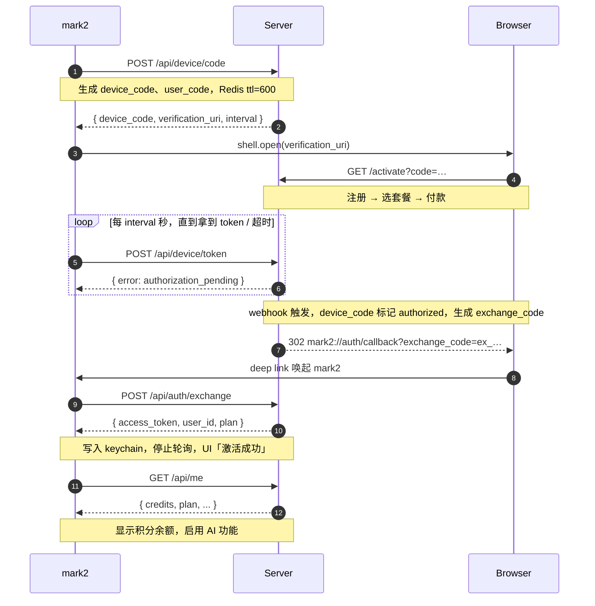
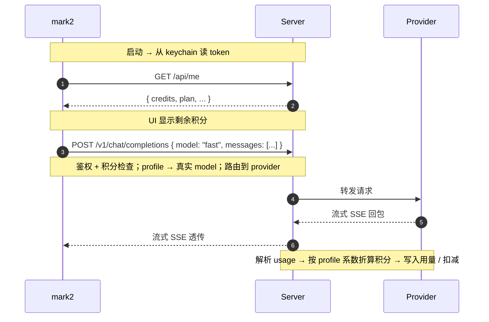
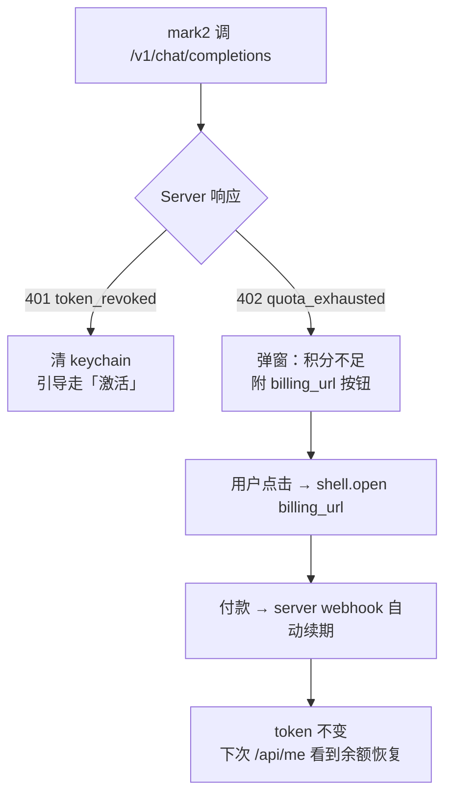
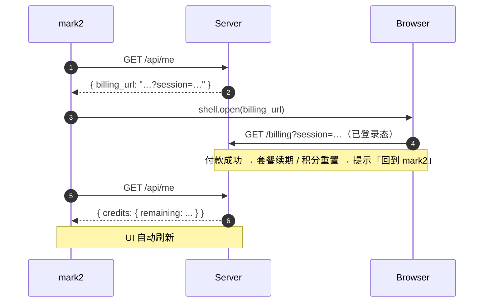

# mark2 ↔ Server AI 网关 API 文档

mark2 客户端通过 `mark2app.com` 提供的 AI 网关使用 AI 能力。用户在 web 端注册付费成为会员后，mark2 通过 deep link 自动激活，全程无需在客户端配置 API key。

- **Base URL**：`https://mark2app.com`
- **Deep link scheme**：`mark2://auth/callback`
- **认证**：long-lived 随机 bearer token，header `Authorization: Bearer <token>`
- **token 失效**：服务端可主动吊销，客户端收到 `401 token_revoked` 后清掉本地 token，重新走激活流程

---

## 1. 接口列表

所有 JSON 接口前缀 `/api`，AI 代理接口前缀 `/v1`（OpenAI 兼容协议）。

### 1.1 设备激活

#### `POST /api/device/code`
申请一对 device code（无需鉴权）

**Request**
```json
{
  "client_id": "mark2-desktop",
  "client_version": "1.7.27",
  "platform": "darwin"
}
```

**Response 200**
```json
{
  "device_code": "d_8f3a2b9c...",
  "user_code": "ABCD-EFGH",
  "verification_uri": "https://mark2app.com/activate?code=d_8f3a2b9c...",
  "expires_in": 600,
  "interval": 3
}
```

字段说明：
- `device_code`：内部用，给客户端轮询
- `user_code`：短码，可显示给用户（备用，万一浏览器没自动跳转）
- `verification_uri`：mark2 用 `shell.open` 打开此 URL 唤起浏览器
- `expires_in`：device_code 有效期（秒），过期需重新申请
- `interval`：建议轮询间隔（秒）

**Errors**
- `429 rate_limited`：客户端 IP 申请过频

---

#### `POST /api/device/token`
轮询：检查 device_code 是否已授权（无需鉴权）

**Request**
```json
{ "device_code": "d_8f3a2b9c..." }
```

**Response 200（已授权）**
```json
{
  "access_token": "tk_live_xxxxxxxxxxxxxxxxxx",
  "user_id": "u_123",
  "plan": "pro_monthly"
}
```

**Response 200（其他状态，与 OAuth Device Flow 一致，全部 200 + error 字段）**
- `{ "error": "authorization_pending" }`：尚未付款
- `{ "error": "slow_down" }`：轮询太快，间隔加倍
- `{ "error": "expired_token" }`：device_code 过期，重新走 `/device/code`
- `{ "error": "access_denied" }`：用户在 web 上拒绝

---

#### `POST /api/auth/exchange`
deep link 回调换 token（无需鉴权）

mark2 接到 `mark2://auth/callback?exchange_code=XXX` 后调此接口换出 long-lived access token。**exchange_code 一次性使用**，避免 token 暴露在 URL / 浏览器历史 / 系统日志。

**Request**
```json
{ "exchange_code": "ex_a1b2c3..." }
```

**Response 200**
```json
{
  "access_token": "tk_live_xxxxxxxxxxxxxxxxxx",
  "user_id": "u_123",
  "plan": "pro_monthly"
}
```

**Errors**
- `400 invalid_exchange_code`：已使用 / 不存在 / 过期（5 分钟 TTL）

---

#### `POST /api/auth/revoke`
主动登出（需鉴权）

**Request**：空 body，仅 header `Authorization: Bearer <token>`

**Response 200**
```json
{ "revoked": true }
```

---

### 1.2 用户与配额

#### `GET /api/me`
查询当前用户信息和配额（需鉴权）

**Response 200**
```json
{
  "user_id": "u_123",
  "email": "user@example.com",
  "plan": "pro_monthly",
  "plan_status": "active",
  "plan_renews_at": "2026-06-04T00:00:00Z",
  "credits": {
    "period": "monthly",
    "limit": 10000,
    "used": 2345,
    "remaining": 7655,
    "reset_at": "2026-06-04T00:00:00Z"
  },
  "billing_url": "https://mark2app.com/billing?session=eyJhbGc..."
}
```

字段说明：
- `plan_status`：`active` / `past_due` / `canceled` / `expired`
- `credits.limit`：本周期总积分额度
- `credits.used`：已消耗积分
- `credits.remaining`：剩余可用积分
- `billing_url`：续费/管理订阅入口，带 server 签发的短期 session，用户点击后浏览器无需再登录

> **积分换算规则**由 server 端维护：每个 model 的输入/输出 token 按各自系数折算成积分。客户端只看积分，不关心具体 model 单价。系数表通过 `/v1/models` 暴露（见下文）。

**Errors**
- `401 token_revoked`：token 被吊销，客户端清理本地状态并引导重新激活

---

### 1.3 AI 代理（OpenAI 兼容）

> **模型由 server 端按用途（profile）配置**，客户端只感知用途别名（如 `fast` / `think` / `vision`），不知道具体 model 名。server 可随时切换底层 provider，客户端零改动。

#### `GET /v1/profiles`
列出当前用户可用的 profile（按用途分类的模型别名）

**Response 200**
```json
{
  "object": "list",
  "data": [
    {
      "id": "fast",
      "label": "快速",
      "description": "日常对话与短回答",
      "context_window": 64000,
      "capabilities": ["text", "tools"],
      "credits_per_1k_input": 1,
      "credits_per_1k_output": 4
    },
    {
      "id": "think",
      "label": "深度思考",
      "description": "复杂推理、长文写作",
      "context_window": 128000,
      "capabilities": ["text", "tools", "reasoning"],
      "credits_per_1k_input": 4,
      "credits_per_1k_output": 16
    },
    {
      "id": "vision",
      "label": "图像理解",
      "description": "解析图片内容",
      "context_window": 128000,
      "capabilities": ["text", "image", "tools"],
      "credits_per_1k_input": 3,
      "credits_per_1k_output": 12
    }
  ]
}
```

字段说明：
- `id`：profile 别名，用于 `/v1/chat/completions` 的 `model` 字段
- `capabilities`：能力标签，客户端据此自动选 profile（例如 messages 含图则用 `vision`）
- `credits_per_1k_input/output`：消耗系数，客户端可预估积分消耗

> server 端可任意调整 profile 背后的真实 model（DeepSeek / GPT / Claude / ...），mark2 完全不感知。新增 profile（如 `code` 编程专用）时，客户端通过此接口动态发现。

---

#### `POST /v1/chat/completions`
完整 OpenAI Chat Completions 协议（含流式 SSE）。mark2 现有 AgentLoop 仅需修改 `baseURL` 和 `apiKey` 即可对接。

**Request**：与 OpenAI 协议一致，但 `model` 字段填 **profile id**
```json
{
  "model": "fast",
  "messages": [...],
  "stream": true,
  "tools": [...],
  "temperature": 0.7
}
```

- `model` 缺省 → server 用 `fast` 兜底
- 不识别的 profile id → 返回 `400 invalid_profile`

**Response**：流式或非流式，与 OpenAI 一致。流式末尾 chunk 带 `usage` 字段，server 据此扣减积分。

**特殊错误**
- `401 token_revoked`：token 被吊销
- `402 quota_exhausted`：积分不足
  ```json
  {
    "error": {
      "type": "quota_exhausted",
      "message": "积分不足，请到 https://mark2app.com/billing 续费",
      "billing_url": "https://mark2app.com/billing?session=..."
    }
  }
  ```
- `429 rate_limited`：短时并发限流
- `502 upstream_error`：上游 provider 故障

> **流式过程中积分耗尽**：server 在 SSE 流内补一个错误 chunk + `[DONE]` 后关闭连接，**已生成的 token 照常计费**（避免被刷）。

---

### 1.4 Web 页面（不是 API，但属于流程一部分）

| 路径 | 用途 |
|---|---|
| `GET /activate?code=<device_code>` | 激活页：未登录走注册/登录 → 套餐选择 → 付款；已登录有会员则直接绑定该 device_code |
| `GET /billing?session=<jwt>` | 已登录用户的订阅管理页（续费、取消、看用量） |

**支付/激活完成后** server 必须做两件事：
1. 把当前 device_code 标记为 authorized，并生成一次性 `exchange_code`（5 分钟 TTL）
2. 浏览器页面 302 到：
   ```
   mark2://auth/callback?exchange_code=ex_a1b2c3...
   ```
   浏览器自动唤起 mark2。如 deep link 失败（用户拒绝了浏览器系统弹窗），页面 fallback 显示「未自动跳转？点这里返回 mark2」按钮，再次点击发同一 URL。

---

### 1.5 云目录

所有接口需鉴权。`path` 一律以 `/` 开头，相对于用户的根目录。

#### `GET /api/cloud/files`
列出目录内容

**Query**：`path=/notes`（默认 `/`）

**Response 200**
```json
{
  "path": "/notes",
  "entries": [
    { "name": "diary.md",   "type": "file",   "size": 1234, "updated_at": "2026-05-06T10:00:00Z" },
    { "name": "assets",     "type": "folder", "updated_at": "2026-05-06T09:00:00Z" }
  ]
}
```

---

#### `GET /api/cloud/files/content`
读取文件内容

**Query**：`path=/notes/diary.md`

**Response 200**
- 文本文件：`Content-Type: text/markdown` 等，body 为原文
- 二进制文件（图片等）：`Content-Type: image/png` 等，body 为字节流

**Headers**：返回 `ETag` 用于后续 PUT 防覆盖

**Errors**
- `404 not_found`

---

#### `PUT /api/cloud/files`
创建或更新文件（multipart/form-data，统一支持文本与二进制）

**Form fields**
- `path`：目标路径（如 `/notes/diary.md`）
- `file`：文件二进制
- `if_match`（可选）：上一次读取拿到的 ETag，用于乐观锁

**Response 200**
```json
{
  "path": "/notes/diary.md",
  "size": 1234,
  "etag": "W/\"abc123\"",
  "updated_at": "2026-05-06T10:30:00Z"
}
```

**Errors**
- `409 etag_mismatch`：内容已被其他设备修改，客户端需提示用户决策
- `413 file_too_large`
- `507 quota_exceeded`：云盘容量耗尽

---

#### `DELETE /api/cloud/files`
删除文件或文件夹（递归删除文件夹）

**Query**：`path=/notes/old.md`

**Response 200**：`{ "deleted": true }`

---

#### `POST /api/cloud/files/move`
移动 / 重命名

**Request**
```json
{ "from": "/notes/old.md", "to": "/archive/old.md" }
```

**Response 200**：`{ "moved": true }`

---

#### `POST /api/cloud/folders`
创建文件夹

**Request**
```json
{ "path": "/notes/2026" }
```

**Response 200**：`{ "created": true }`

---

#### `GET /api/cloud/usage`
查询云盘使用量

**Response 200**
```json
{
  "used_bytes": 12345678,
  "limit_bytes": 10737418240,
  "file_count": 234
}
```

---

### 1.6 分享链接

所有创建/管理类接口需鉴权；`/s/:id` 公开访问页无需鉴权。

#### `POST /api/share`
为云目录中的文件创建分享链接

**Request**
```json
{ "path": "/notes/diary.md" }
```

**Response 200**
```json
{
  "share_id": "s_a1b2c3",
  "share_url": "https://mark2app.com/s/s_a1b2c3",
  "path": "/notes/diary.md",
  "created_at": "2026-05-06T10:30:00Z"
}
```

> 同一文件重复调用返回同一个 share_id（幂等）。

---

#### `GET /api/share`
列出当前用户的所有分享

**Response 200**
```json
{
  "shares": [
    {
      "share_id": "s_a1b2c3",
      "path": "/notes/diary.md",
      "share_url": "https://mark2app.com/s/s_a1b2c3",
      "created_at": "2026-05-06T10:30:00Z",
      "view_count": 42
    }
  ]
}
```

---

#### `DELETE /api/share/:share_id`
撤销分享

**Response 200**：`{ "revoked": true }`

撤销后访问 `/s/:share_id` 返回 410 Gone。

---

#### `GET /s/:share_id`（Web 页面，公开访问）
公开渲染分享的 markdown 文件。

- 命中已撤销的 id：`410 Gone`
- 未找到：`404 Not Found`
- 正常：返回 server 端渲染好的 HTML 页面（与 mark2 主题一致）

> 文件中引用的图片等资源通过 server 端代理访问（如 `/s/:share_id/assets/xxx.png`），无需用户的 token。

---

## 2. 通信流程

### 2.1 首次激活



**双通道兜底**：轮询和 deep link 同时跑，先到先用。
- Deep link 先到 → exchange_code 换 token → 通知轮询任务取消
- 轮询先到（极少见，比如 deep link 被系统拦截） → 直接拿到 token → 忽略后续 deep link

---

### 2.2 日常使用 AI



---

### 2.3 配额耗尽 / token 失效



---

### 2.4 续费（已激活用户）



> 续费比首次激活简单：token 不换，只刷新积分余额。`billing_url` 里的 `session` 是 server 签的短期 JWT，让 web 端识别用户身份，无需重新登录。

---

## 3. Server 端数据存储速记

| 表 / Key | 字段 | 备注 |
|---|---|---|
| `users` | id, email, password_hash, created_at | |
| `subscriptions` | user_id, plan, status, current_period_end | 支付 webhook 维护 |
| `tokens` | token_hash, user_id, created_at, revoked_at, last_used_at | **只存 hash**，明文只在签发时返回一次 |
| `credits_balance` | user_id, period, limit, used, reset_at | 当前周期积分账本 |
| `usage`（按月分表 / 按天聚合） | user_id, profile, real_model, input_tokens, output_tokens, credits, ts | 计费 / 限额依据；同时记录 profile 与实际 model 便于审计 |
| `profiles`（配置） | id, label, real_model, provider, credits_per_1k_input, credits_per_1k_output, capabilities | server 端可热更新 |
| `device_codes`（Redis） | `device_code` → `{ user_code, status, user_id?, exchange_code? }`，ttl=600 | |
| `exchange_codes`（Redis） | `exchange_code` → `{ user_id, used? }`，ttl=300，**一次性** | |

---

## 4. mark2 客户端实现要点

### 4.1 Tauri deep link 注册
- `tauri.conf.json` 的 `bundle.macOS.urlSchemes` 加 `mark2`
- Windows 注册表 / Linux .desktop 同步配置
- 监听 deep link 事件，解析 `exchange_code` 调 `/api/auth/exchange`

### 4.2 token 持久化
- macOS：Keychain
- Windows：Credential Manager
- Linux：libsecret
- 推荐使用 `tauri-plugin-keyring` 或自写 wrapper

### 4.3 AgentLoop 改造
现有 OpenAI 兼容 AgentLoop 仅需修改：
- `baseURL = "https://mark2app.com/v1"`
- `apiKey = <从 keychain 读取的 access_token>`
- `model` 字段不再是具体模型名，改为 profile id（如 `"fast"` / `"think"` / `"vision"`）
- profile 列表通过 `GET /v1/profiles` 拉取，UI 上提供「快速 / 思考」切换；含图片的对话自动用 `vision`

BYOK 模式保留，挪到「高级设置」入口给极客用户。

### 4.4 启动流程
1. 读 keychain → 有 token 调 `/api/me`
   - 200 → 进入正常使用
   - 401 → 清 token，进入未激活态
   - 网络错误 → 离线提示
2. 无 token → AI 入口显示「激活」按钮

---

## 5. MVP 实现顺序

1. **Server**：`/device/code` + `/device/token` + `/auth/exchange` 三个接口跑通；先写死一个测试 user 直接 authorized，不接支付
2. **mark2**：deep link 注册 + 激活按钮 + 轮询逻辑 + keychain 存储 + AgentLoop 改造
3. 跑通 happy path（点击激活 → 浏览器 → 假支付 → 跳回 mark2 → AI 可用）
4. Server 接 Stripe / 支付宝 + 注册登录页
5. `/api/me` + 用量面板 + 续费流程
6. 积分扣减 + 滥用防护 + 多 provider 路由
