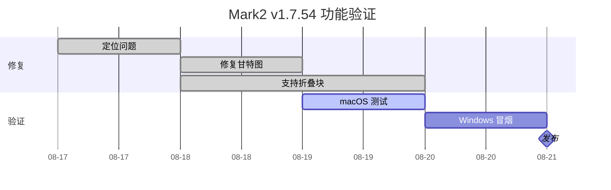

# Issue #19：甘特图与折叠块测试

本文档用于验证 Mermaid 甘特图和 `<details>` 折叠块在 Mark2 预览模式下的行为。

## 1. Mermaid 甘特图

预期：下方显示完整甘特图，宽度不为零；调整窗口宽度后图表保持可见。



## 2. 默认收起

预期：首次显示为收起状态，点击标题后显示正文，再次点击可以收起。

<details id="closed-example" class="test-details">
<summary>点击展开默认收起的内容</summary>

这里是默认收起的正文。

- 支持普通段落
- 支持 **加粗文字**
- 支持 `inline code`
- 支持 [链接](https://example.com)

</details>

## 3. 默认展开

预期：首次加载时正文可见，点击标题可以收起。

<details open>
<summary>默认展开的内容</summary>

这段内容应该在文档打开时直接显示。

> 折叠块正文中的引用也应正常渲染。

```javascript
function detailsTest() {
    return 'code block inside details';
}
```

</details>

## 4. 嵌套折叠

预期：外层和内层可以分别展开、收起，互不影响。

<details>
<summary>外层折叠块</summary>

外层正文。

<details>
<summary>内层折叠块</summary>

内层正文，包含一个任务列表：

- [x] 解析为独立节点
- [x] 点击可以折叠
- [ ] Windows 最终冒烟测试

</details>

外层折叠块末尾内容。

</details>

## 5. 往返保存检查

请完成以下操作：

1. 分别展开、收起上面的折叠块。
2. 切换到源码模式，再切回预览模式。
3. 在某个折叠块正文中修改一行文字并保存。
4. 重新打开本文档。
5. 确认 Mermaid 仍可见，`<details open>` 仍默认展开，嵌套内容和 Markdown 格式没有丢失。
