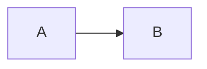

# 块结构样本

> 引用第一行
> 引用第二行

1. 有序项
2. 另一项

- [x] 已完成
- [ ] 待完成

~~~~javascript
const message = "保留围栏";
console.log(message);
~~~~

```mermaid
flowchart LR
    A --> B
```

$$
E = mc^2
$$

点击查看

折叠区域正文。

